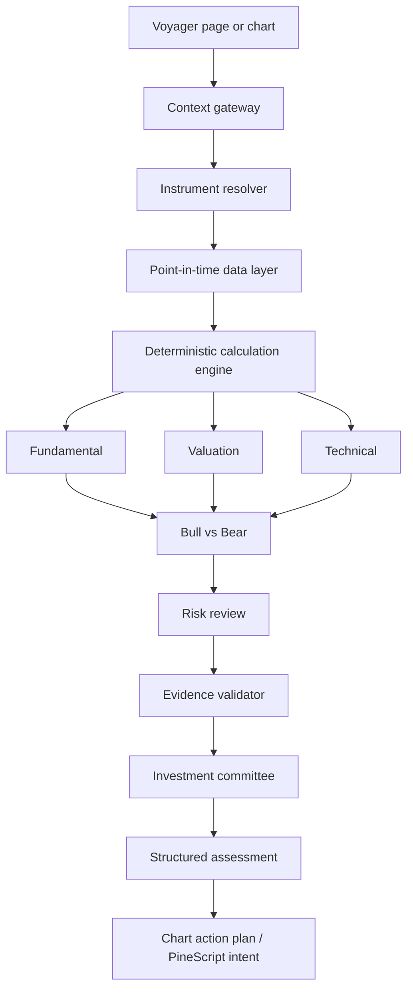
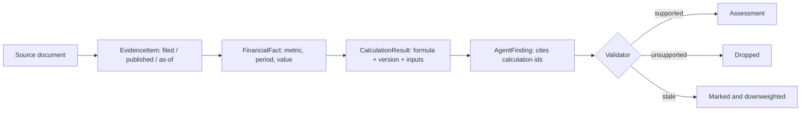

# Architecture

## The pipeline

Ordering is the load-bearing part, not the box count:

- **data is filtered to the cutoff before anything is computed**, so a leak
  cannot enter downstream;
- **every calculation finishes before any agent reads one**, so two agents
  cannot disagree about what a number *is* — only about what it means;
- **the validator runs after every agent and before the committee**, so the
  committee never weighs a claim nobody checked.

## Evidence flow

A claim can only cite what already exists. `validateClaim` resolves every cited
id and fails the claim when one is missing — including the case that matters
most, where a cited calculation *ran and declined to produce a number*. That is
the opposite of evidence for one, and a naive "does it cite anything" check
passes it.

## Why a plain pipeline rather than a graph framework

The stages are fixed, the fan-out is one level deep, and the state is a single
object passed forward. A graph library would add a dependency and a vocabulary
without changing what runs. Each stage here is an ordinary function, testable on
its own — which is how the wiring bug described in `LIMITATIONS.md` was caught.

## Why TypeScript in the repository

The specification asks for a Python service if the backend is Node-only, and
also says to match the existing stack first. The deciding facts: the portal
deploys as one Next.js service, there is no Python and no Redis, and a second
service would mean the engine could not be reached from the deployed Voyager
until new infrastructure existed. The engine uses the session, the database and
the model client the portal already has.

The trade accepted: no pandas or scipy, so every formula is written by hand with
its own tests. That is the same choice already made for the chart indicators,
and it is why each formula carries a version and a fixture with a known result.

## Deliberate refusals

| Refused | Why |
|---|---|
| BUY / HOLD / SELL | An imperative about someone's money that the analysis cannot support. The stance vocabulary describes a reading, not an instruction. |
| Model-stated confidence | Correlates with fluency, not with evidence. Assembled in code from seven named components instead. |
| Averaging agent stances | Lets three agreeable readings outvote one evidenced objection. The committee weighs by evidence. |
| Support levels as fact | Returned as candidates with the method attached. Price turned there before; that is not a floor. |
| Suitability without a portfolio | `requires_user_context`. A good company is not automatically a good holding for a particular person. |
| A number when an input is missing | `null`, plus a warning saying why the method did not apply. |
